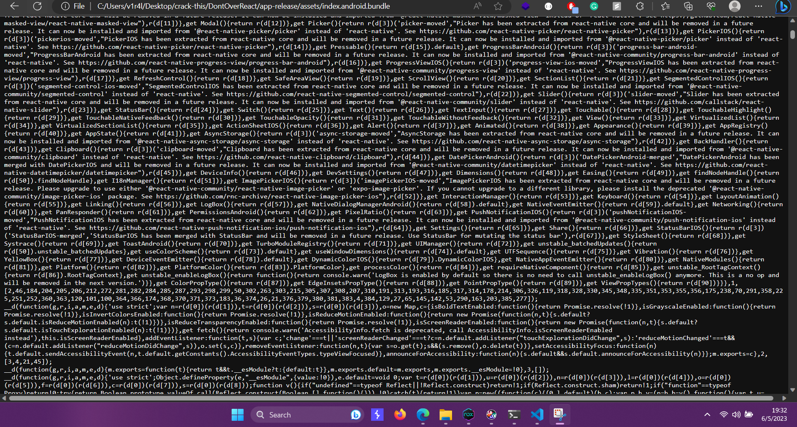

## See The Sharp Flag
link to the challenge: https://app.hackthebox.com/challenges/255

### Description:
Downloaded the apk file, decompiled it using jadx-gui. 
Saw that code is written in ReactNative, there was nothing in the java code, so I searched on the internet about reactnative and its native libraries.

So i found that its stored in the .bundle file, so i unzipped the apk file 

and found the /assets/index.android.bundle  file. 

i just opened it in the browser,code was really messy, as you can see in the screenshot below.

First I Searched for the "flag", Didnt find anything, then i randomly searched for "base64" and I found a string, decoded it using base64 and got the flag!!!!
