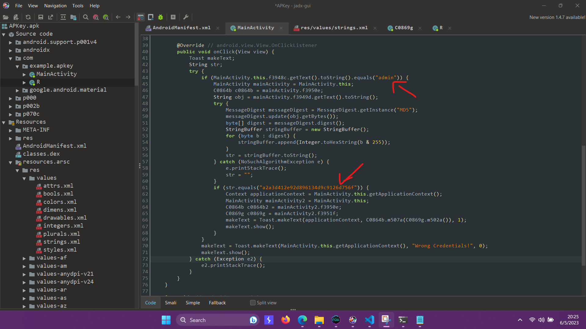
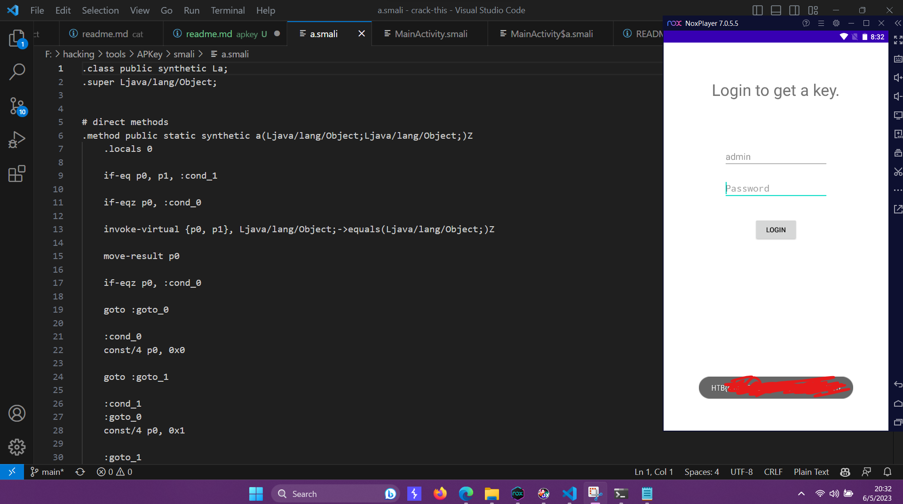

## See The Sharp Flag
link to the challenge: https://app.hackthebox.com/challenges/cat

### Description:

As the Description says 
```
CHALLENGE DESCRIPTION
This app contains some unique keys. Can you get one?
```

So first I installed the app in emulator and check the UI, it was a login form. without any further delay I decompiled the apk file using jadx-gui. and checked for the source-code. 

Found some interesting hard-coded strings there. 



its checking for the username value should be "admin" and if its correct then checking MD5 hash of the password. 
So tried to run apktool, and tried changing dalvik opcode #if-eqz to if-nez and recompiled the app.

Used this command for decompiling the apk file:
```
apktool d -f -r app.apk
```
and for recompiling the apk file:
```
apktool b -f -r app
```

After that sometimes it shows signature error, so I used this command to sign the apk file:

Generate keystore:

```
keytool -genkey -v -keystore my-release-key.keystore -alias my_alias -keyalg RSA -keysize 2048 -validity 10000
```

Sign APK
```
jarsigner -verbose -sigalg SHA1withRSA -digestalg SHA1 -keystore my-release-key.keystore -storepass viralviral -keypass MY_PASS "app.apk" my_alias
```
and after that installed the updated apk. and boom, We found the flag
